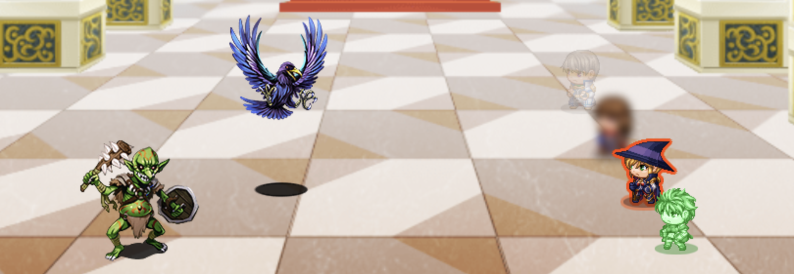
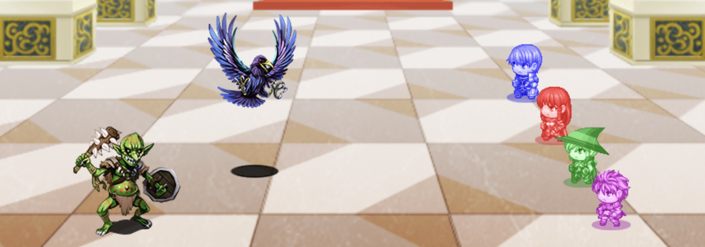
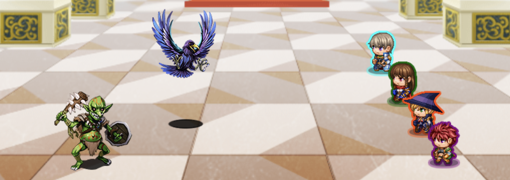
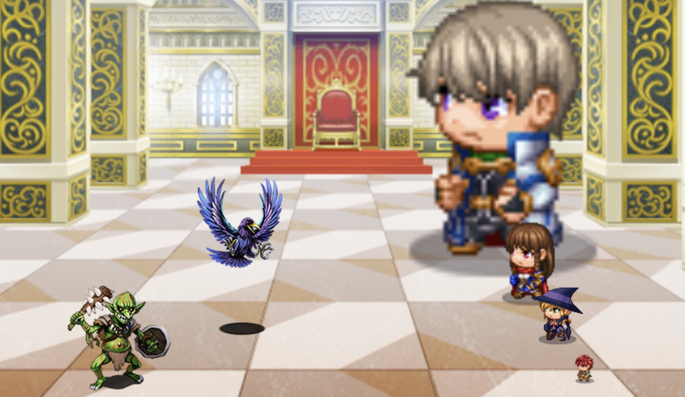
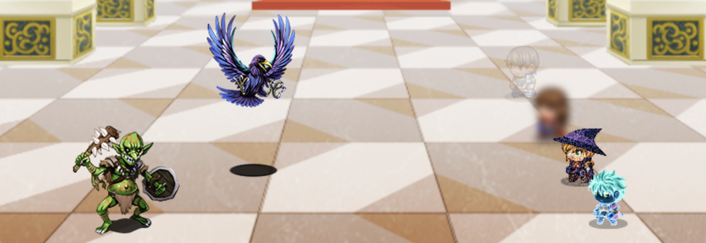

# Battler States

This plugin for RPG Maker MZ give battlers unique visual effects based on their states.

For example, you could add a "Vanished" state that includes `<battler:translucent>` in its note. Whenever a character gains the Vanished state, their battler will look like the top battler in this first screenshot:

## Supported note tags

### Colors

The tint of your battler.

- `<battler:white>`
- `<battler:black>`
- `<battler:red>`
- `<battler:green>`
- `<battler:blue>`
- `<battler:purple>`
- `<battler:brown>`
- `<battler:orange>`
- `<battler:pink>`
- `<battler:yellow>`
- `<battler:cyan>`

Or a custom color:

- `<battler:color r,g,b,gray>`
  - (where each is 0 to 255)

### Outline colors

A border around your battler.

- `<battler:outline-white>`
- `<battler:outline-black>`
- `<battler:outline-red>`
- `<battler:outline-green>`
- `<battler:outline-blue>`
- `<battler:outline-purple>`
- `<battler:outline-brown>`
- `<battler:outline-orange>`
- `<battler:outline-pink>`
- `<battler:outline-yellow>`
- `<battler:outline-cyan>`

Or a custom outline color:

- `<battler:outline-color r,g,b>`
  - (where each is 0 to 255)

### Size

How large or small your battler is.

- `<battler:shrink>`
  - (same as `<battler:size 0.5>`)
- `<battler:grow>`
  - (same as `<battler:size 1.5>`)

Or a custom size:

- `<battler:size x>`
  - (where `x` is a decimal number, 1.0 being default)

### Opacity

How much you can(not) see through your battler.

- `<battler:translucent>` (same as `<battler:opacity 50>`)

Or a custom opacity:

- `<battler:opacity x>` (where `x` is 0 to 255, 0 being fully transparent)

### Miscellaneous

- `<battler:blur>`
- `<battler:grain>`
- `<battler:invert>`

## Installation

Copy [BattlerStates.js](./BattlerStates.js) into your plugins folder. [Full instructions](https://www.rpgmakerweb.com/blog/using-plugins-in-mz)

## Known issues

The "[SV] Overlay" of a state (if used) will also be affected. For example, it would also have an outline if you use `<battler:outline-red>`.
