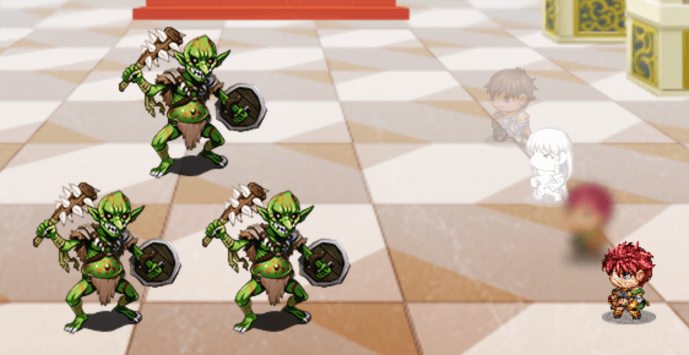

# Battler States

This plugin for RPG Maker MZ give battlers unique visual effects based on their states.

For example, you could add a "Vanished" state that includes `<effect:translucent>`. Whenever a character gains the Vanished state, their battler will look like the top battler in this screenshot:

Supported effects:

- `<effect:white>`
- `<effect:black>`
- `<effect:red>`
- `<effect:green>`
- `<effect:blue>`
- `<effect:outline-white>`
- `<effect:outline-black>`
- `<effect:outline-red>`
- `<effect:outline-green>`
- `<effect:outline-blue>`
- `<effect:translucent>`
- `<effect:blur>`
- `<effect:grain>`
- `<effect:invert>`

## Installation

Copy [BattlerStates.js](./BattlerStates.js) into your plugins folder. [Full instructions](https://www.rpgmakerweb.com/blog/using-plugins-in-mz)
