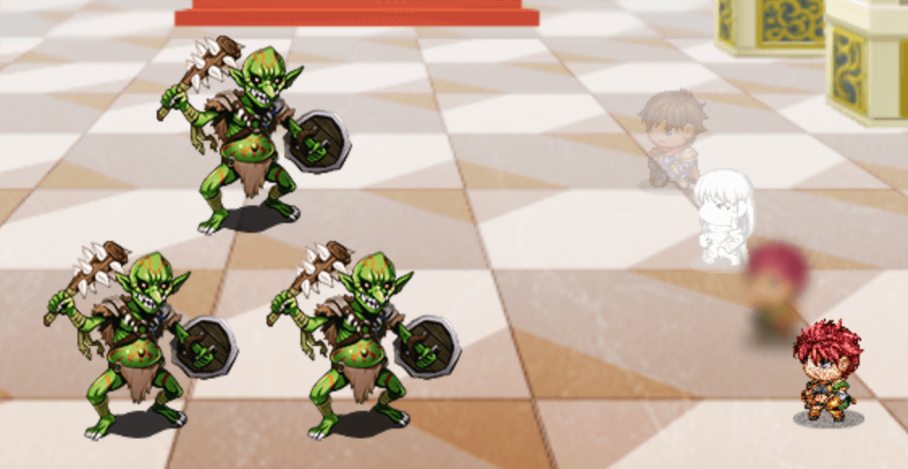
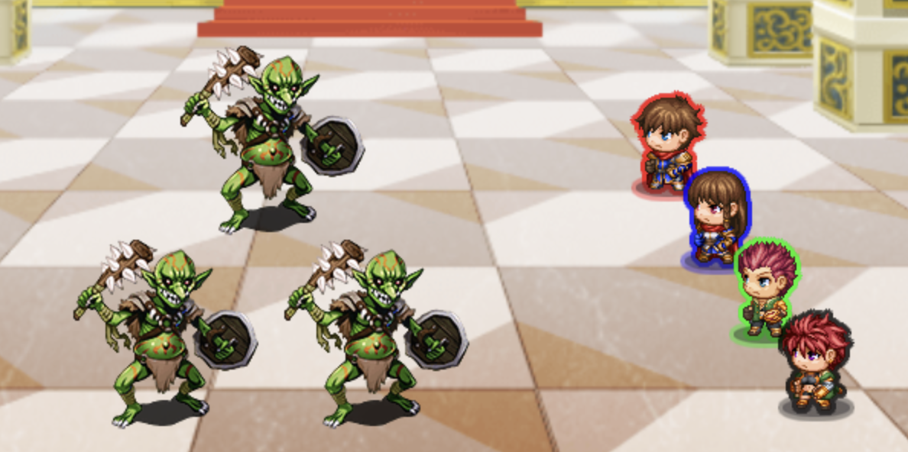

# Battler States

This plugin for RPG Maker MZ give battlers unique visual effects based on their states.

For example, you could add a "Vanished" state that includes `<battler:translucent>` in its note. Whenever a character gains the Vanished state, their battler will look like the top battler in this first screenshot:

| translucent, white, blur, grain                                                  | outlines                                                    |
| -------------------------------------------------------------------------------- | ----------------------------------------------------------- |
|  |  |

Supported note tags:

- `<battler:color r,g,b,gray>` (where each is 0 to 255)
- `<battler:white>`
- `<battler:black>`
- `<battler:red>`
- `<battler:green>`
- `<battler:blue>`
- `<battler:outline-white>`
- `<battler:outline-black>`
- `<battler:outline-red>`
- `<battler:outline-green>`
- `<battler:outline-blue>`
- `<battler:translucent>`
- `<battler:blur>`
- `<battler:grain>`
- `<battler:invert>`
- `<battler:shrink>`
- `<battler:grow>`
- `<battler:size x>` (where x is a decimal number, 1 being default)

## Installation

Copy [BattlerStates.js](./BattlerStates.js) into your plugins folder. [Full instructions](https://www.rpgmakerweb.com/blog/using-plugins-in-mz)
